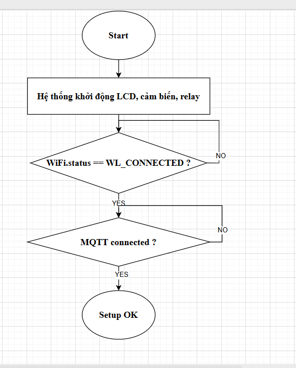
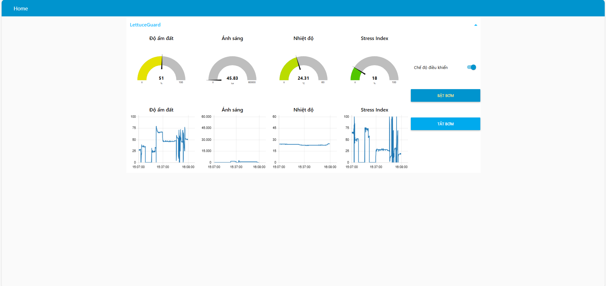
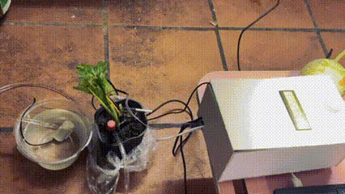

# LettuceGuard v2 — Hệ thống giám sát và tưới tự động cho rau xà lách

## Thông tin sinh viên
- **Họ tên:** Phạm Như Mạnh  
- **MSSV:** 22001334  
- **Lớp:** K67- Kỹ thuật điện tử và tin học  
- **Email:** phamnhumanh_t67@hus.edu.vn

---
## 1. Giới thiệu dự án
LettuceGuard v2 là dự án hệ thống giám sát và tưới tự động cho mô hình trồng xà lách trong nhà/thủy canh/khay đất nhỏ. Hệ thống sử dụng các cảm biến môi trường để đo **độ ẩm đất**, **cường độ ánh sáng**, và **nhiệt độ không khí**, sau đó tính toán một chỉ số **stress (căng thẳng của cây)** nhằm đánh giá tình trạng hiện tại của cây. Khi stress vượt ngưỡng, hệ thống sẽ **tự động bật bơm** trong chế độ AUTO.

Hệ thống hỗ trợ điều khiển qua **MQTT**, cho phép người dùng theo dõi trạng thái và điều khiển bơm từ xa.

---

## 2. Chức năng chính
- Đo độ ẩm đất bằng analog.
- Đo ánh sáng bằng BH1750.
- Đo nhiệt độ bằng cảm biến DS18B20.
- Tính toán chỉ số **stress 0–100%** dựa trên các thông số môi trường.
- Điều khiển bơm tự động (AUTO) hoặc thủ công (MANUAL).
- Giới hạn thời gian bơm tối đa 15 giây để tránh úng.
- Gửi dữ liệu sensor lên MQTT mỗi 5 giây.
- Nhận lệnh MQTT: `AUTO`, `MANUAL`, `PUMP_ON`, `PUMP_OFF`.
- Màn hình LCD hiển thị trạng thái thời gian thực.

---

## 3. Sơ đồ khối hệ thống
```
+-----------------+
|   Cảm biến đất  |--+
+-----------------+  |
                    |
+-----------------+  |        +-------------------+
|    BH1750        |--+-----> |                   |
+-----------------+  |        |  ESP32 (main MCU) |----> MQTT Cloud (HiveMQ)
                    |        |                   |
+-----------------+  |        +---------+---------+
|   DS18B20       |--+                  |
+-----------------+                     |
                                        v
                                +---------------+
                                |   Relay + Bơm |
                                +---------------+
```

---

## 4. Thuật toán hoạt động
### ● Chu kỳ đọc dữ liệu
- Mỗi 5 giây đọc tất cả cảm biến
- Tính stress
- Điều khiển bơm nếu AUTO
- Gửi JSON lên MQTT
- Cập nhật LCD

### ● Điều khiển bơm
```
if (autoMode) {
    if (stress >= 70 && !pumpRunning)
        pumpOn();

    if (pumpRunning > 15 giây)
        pumpOff();
}
```
MANUAL cho phép bật/tắt bơm thủ công.

---

## 5. Lưu đồ thuật toán (flowchart)

### ● Lưu đồ Setup


### ● Lưu đồ Setup


## 6. Hình ảnh sản phẩm

### ● Giao diện Dashboard


### ● Ảnh phần cứng thực tế


### ● Sơ đồ nối dây


---

## 7. Video demo
 Video demo
*https://www.youtube.com/watch?v=1p3r7YqkuDA*

---

## 8. JSON gửi lên MQTT
Ví dụ:
```json
{
  "humidity": 55.2,
  "light": 12345,
  "airTemp": 28.7,
  "stress": 62,
  "mode": "AUTO",
  "errors": []
}
```

---

## 9. Kết luận
Sau khi hoàn thiện dự án:
- Hệ thống hoạt động ổn định, gửi dữ liệu đều đặn lên MQTT.
- Stress index phản ánh khá chính xác tình trạng môi trường.
- Điều khiển AUTO/MANUAL qua MQTT nhanh và chính xác.
- Cơ chế giới hạn 15 giây giúp tránh tưới quá tay.
- LCD hiển thị rõ ràng, dễ quan sát.

Hướng phát triển:
- Thêm đo độ ẩm không khí.
- Thêm quạt làm mát.
- Nâng cấp stress model thông minh hơn (AI/Regression).
- App dashboard trực quan.

---

**© 2025 — LettuceGuard v2**
